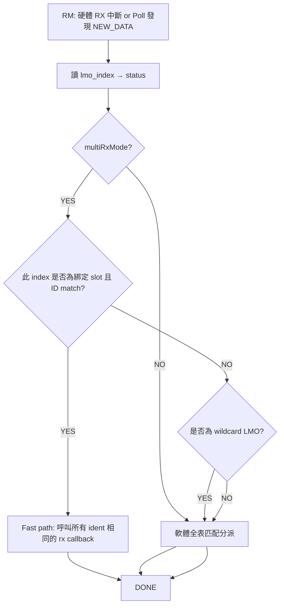

以下是目前多 RX LMO 綁定 / Wildcard / 動態 COB‑ID / 維護提升整體邏輯的流程圖與說明（對應你現在的程式版本）。我拆成多個子流程，方便閱讀。你可以用 Mermaid (若支援) 或純文字 ASCII 版本。

---

## 1. 系統初始化 (CO_CANmodule_init)

```mermaid
flowchart TD
    A[啟動 / DAVE_Init 成功] --> B[CO_CANmodule_init()]
    B --> C{統計 LMO 類型}
    C -->|1 RX + 1 TX| D[單一 MO 模式 g_singleMoMode=true<br/>RX LMO 設 ID=0x000 開放 + 軟體過濾]
    C -->|1 TX + >=2 RX| E[多 RX 模式 g_multiRxMode=true]
    C -->|其他| F[回退 軟體過濾模式]

    E --> G[收集所有 RX LMO 索引存入 g_rxLmoIndexMap[]]
    G --> H[指定最後一個 RX LMO 為 wildcard (ID=0, mask=0) 嘗試全收]
    H --> I[g_totalRxLmos-- (不把 wildcard 納入可分配池)]
    I --> J[等待後續 rx buffer 註冊]
```

---

## 2. 接收緩衝註冊 (CO_CANrxBufferInit)

```mermaid
flowchart TD
    A[CO_CANrxBufferInit(ident, mask)] --> B{單一 MO 模式?}
    B -->|YES| B1[只記錄軟體過濾<br/>dave_lmo=單一RX LMO] --> Z[Return]
    B -->|NO| C{multiRxMode?}
    C -->|NO| C1[軟體過濾回退<br/>dave_lmo=NULL] --> Z
    C -->|YES| D{ident==0x000?}
    D -->|是且尚未綁定NMT| D1[設定 g_nmtBound=true<br/>進入正常綁定流程] --> E
    D -->|是且已綁定NMT| D2[標記為軟體過濾 RX-SKIP0] --> Z
    D -->|否| E[標準綁定流程]
    
    E --> F{是否已有相同 ID 硬體綁定? (排除 wildcard)}
    F -->|YES| F1[共用該硬體 LMO, dave_lmo指向] --> Z
    F -->|NO| G{是否存在尚未使用的 RX LMO slot? (排除 wildcard)}
    G -->|YES| G1[設定硬體 ID + mask=0x7FF<br/>used=true 綁定成功] --> Z
    G -->|NO| H[軟體過濾 (SWFALLBACK)] --> I{是否高優先級?}
    I -->|YES| I1[列印 RX-PRIO-DEFER 等待後續提升] --> Z
    I -->|NO| Z[Return]
```

高優先級判定 (目前)：  
- NMT (0x000)（已特殊處理，只允許一個）  
- SYNC (0x080)  
- 本節點 EMCY (0x080 + NodeID)  
- SDO RX (0x600 + NodeID)

---

## 3. 動態 COB‑ID 變更 (SDO 寫入 PDO Comm 參數 → schedule → apply)

```mermaid
flowchart TD
    A[SDO 寫入 0x1400/0x1800:1] --> B{bit31=1?}
    B -->|YES| C[CO_XMC_scheduleCobIdDisable()] --> H
    B -->|NO| D[CO_XMC_scheduleCobIdChange(old->new)] --> H
    H[排程表 g_cobidChanges[] pending=true]

    subgraph 定時 1ms
        H1[CO_XMC_applyCobIdChanges()] --> J{找到對應 LMO?}
        J -->|NO| J1[等待/逾時提示] --> H1
        J -->|YES| K{是 TX?}
        K -->|YES| K1[待 TX 不在 TX_PENDING 後改 ID + Init]
        K -->|NO| L{disable?}
        L -->|YES| L1[RX: disable → 設 dummy 0x7FE<br/>Disable RxEvent + 釋放綁定 + 嘗試提升其他優先級]
        L -->|NO| L2[RX: DisableRxEvent → 清 pending → 設新ID → Init → EnableRxEvent<br/>更新綁定表]
    end
```

---

## 4. 釋放綁定與優先級提升 (CO_XMC_updateBindingOnIdChange → promote)

```mermaid
flowchart TD
    A[RX PDO disable or COB-ID reassigned] --> B[g_rxBindings[b].used=false]
    B --> C[CO_XMC_promotePriorityToHardware()]
    C --> D[掃描軟體過濾 rxArray 中的高優先級 ID]
    D -->|找到| E[把 freed LMO 改成該 ID + Init + Enable<br/>更新綁定 + 修改 rxArray 指向]
    D -->|沒找到| F[保持空閒，等待後續]
```

---

## 5. 延遲維護 / 搶占 (CO_XMC_maintainRxBindings 每 10ms)

```mermaid
flowchart TD
    T[每 10ms 定時] --> A[遍歷全部 rxArray]
    A --> B{buf.ident != 0x000 && buf.dave_lmo == NULL?}
    B -->|NO| A
    B -->|YES| C{是否已有相同 ID 綁定?}
    C -->|YES| C1[共用綁定，更新 dave_lmo] --> A
    C -->|NO| D{尚有空閒硬體 LMO? (排除 wildcard)}
    D -->|YES| D1[分配 + 設硬體ID + Enable + 綁定] --> A
    D -->|NO| E{ID 高優先級?}
    E -->|NO| A
    E -->|YES| F[嘗試搶占最低優先級綁定 LMO (score 更低)] --> G{成功?}
    G -->|YES| G1[重新配置該 LMO 為新 ID] --> A
    G -->|NO| A
```

---

## 6. 收到 CAN 中斷 / 輪詢 (CO_CANinterrupt_Rx / CO_CANmodule_process)



---

## 7. Wildcard LMO 行為

目前實作：  
- 使用最後一個 RX LMO 設（ID=0x000, mask=0x000）期望「全接收」。  
- 若實測 XMC 硬體對 mask=0x000 解釋不是「全部忽略」而是「精確匹配」，則此 wildcard 只會收 0x000 → 可改策略：  
  - 方案 A：不要手動改其 mask，保留 DAVE UI 預設 (若 DAVE 已設定成接收全部)。  
  - 方案 B：新增一個專用軟體輪詢 LMO，硬體 ID 不改動，放寬 acceptance。  
  - 方案 C：不用 wildcard，所有未綁定 ID 依靠延遲維護最終綁定。

---

## 8. 識別「怪怪的」現象的根本原因

| 現象 | 根本原因 | 已採取措施 |
|------|----------|-----------|
| 大量 `[RX-BIND] 共用 LMO_03 ID=0x000` | 初始多數 rx buffer ident=0 placeholder 都被硬體綁定 | 限制只允許第一個 0x000 硬體綁定，其它改軟體過濾 |
| PDO 實際 ID (0x20A/0x30A/0x40A) 最初沒硬體 LMO | 註冊時 ident 尚未更新，錯過硬體綁定時機 | 加入定期 `CO_XMC_maintainRxBindings()` 延遲分配與搶占 |
| 中斷未出現 | 可能 wildcard 沒真的放行所有 ID 或尚未綁定 | 延遲綁定 + 若仍無則需調整 wildcard mask 邏輯 |
| 高優先級未升級 | 無釋放事件或無背景維護 | 已新增維護 + 搶占低優先級 |

---

## 9. ASCII 簡版總流程圖 (濃縮)

```
Init:
  Scan LMOs -> if (1TX, >=2RX) multiRxMode=1 -> last RX = wildcard -> others candidate pool

rxBufferInit(ident):
  if singleMO -> SW only
  else if multiRx:
     if ident==0:
        if !g_nmtBound -> allow 1st bind
        else -> SW only
     else try:
        reuse binding -> OK
        else free slot -> program HW -> bind
        else SW fallback (+prio defer note)
  else -> SW only

Timer(1ms):
  applyCobIdChanges()
  maintainRxBindings():
     for each rx buf with ident!=0 && no HW:
        if existing binding -> point to it
        else if free HW slot -> bind
        else if high prio -> try preempt lower prio

COB-ID change apply:
  locate LMO
  if RX:
     disable → clear pending → (disable? dummy) else program new ID → re-enable
     update binding / promote on disable

RX interrupt/poll:
  if multiRx and LMO bound & ID match -> fast callbacks
  else (wildcard or unbound) -> SW scan all rxArray
```

---

## 10. 可能的下一步建議

| 項目 | 說明 | 風險 |
|------|------|------|
| Wildcard mask 語義驗證 | 確認 XMC CAN AMR=0 代表「全 don't care」或「全必須匹配 0」 | 若誤用則 PDO 收不到 |
| 將 wildcard 改為「保留但不改 mask」 | 使用 DAVE 預設設定 (若 DAVE 已設定成接收所有) | 需確認 DAVE 預設 |
| 增加一次性延遲 (e.g. after CO_CANopenInit) 強制執行 maintain | 加快 PDO 綁定完成時間 | 過早執行仍是 ident=0 |
| 加入可查詢 API 回傳某 ID 是否硬體綁定 | 提升除錯效率 | 無 |
| 綁定重構為雙層（固定優先 LMO 池 + 動態池） | 穩定高優先級 | 增加複雜度 |

---

如果你希望我：

1. 調整 wildcard 實作（改策略）  
2. 增加「查詢某 ID 是否硬體綁定」API  
3. 移除/條件包 `g_hb_fallback_count` 等未用變數  
4. 將此流程圖加入專案文件 (e.g. 多RX_LMO_配置規劃.md)  

告訴我要哪一項，我直接幫你做。  

需要哪個後續動作？直接回覆選項或補充你的新觀察。
