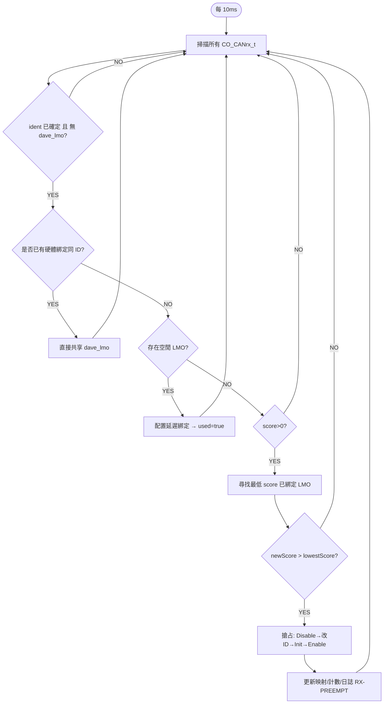
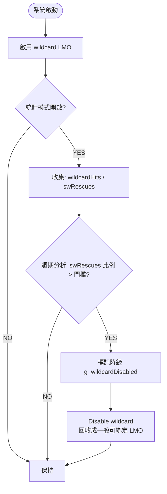
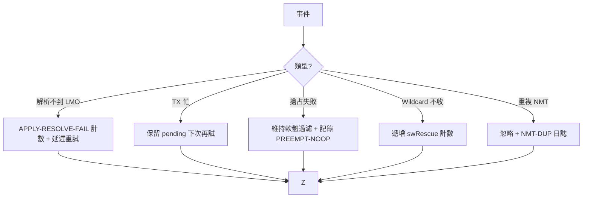
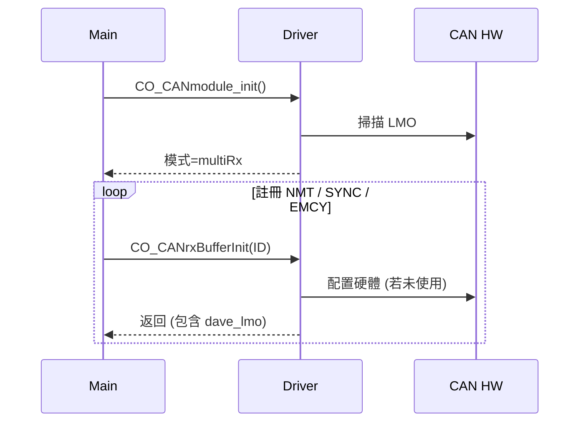
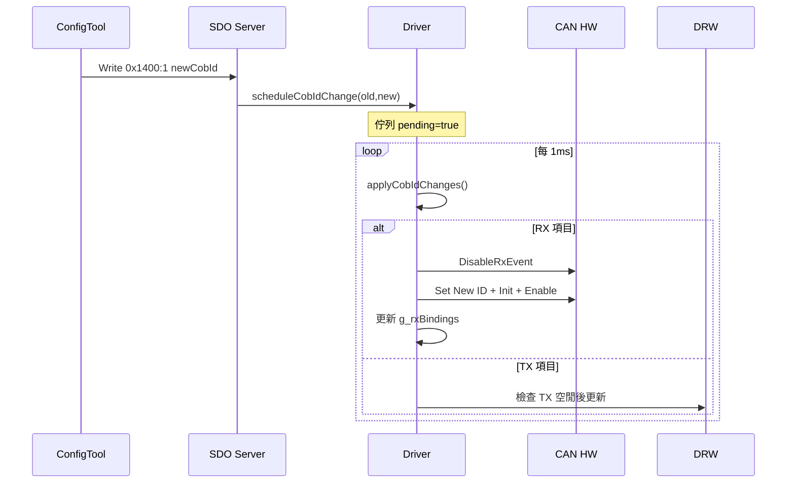
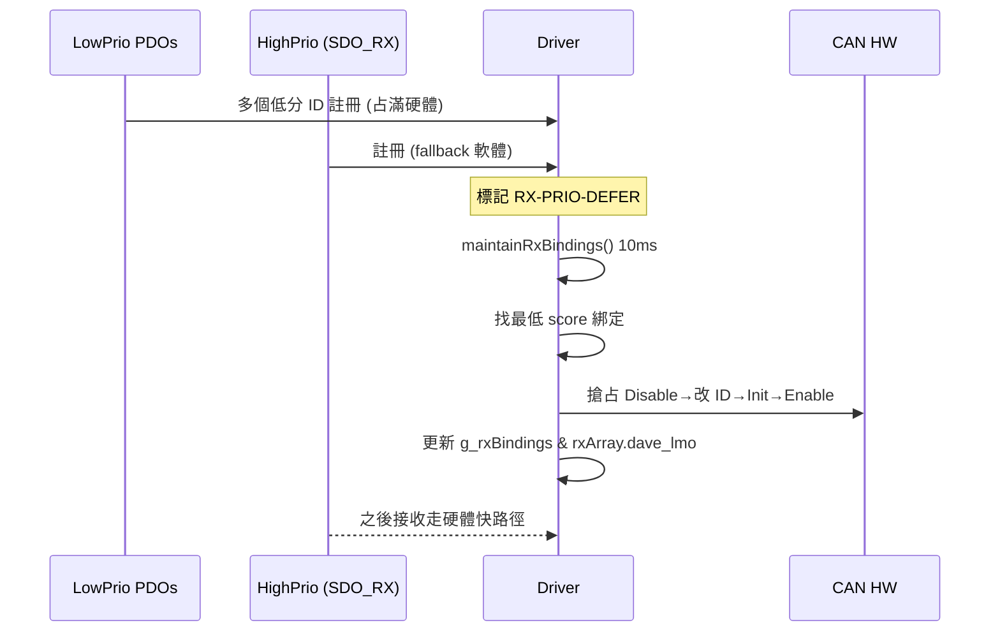
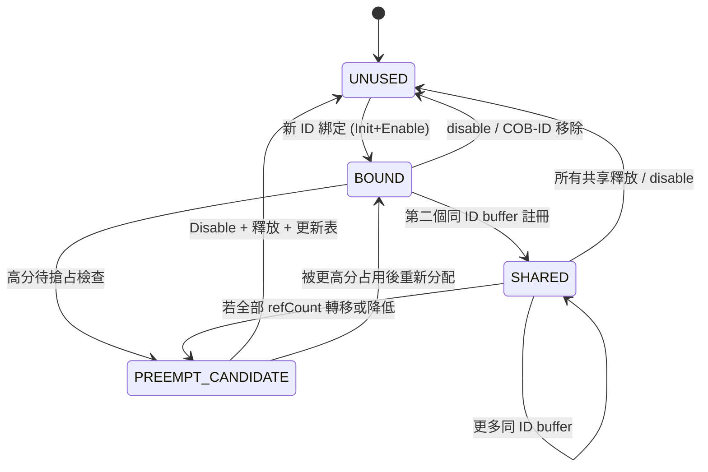

# 多 RX LMO 驅動核心流程 & 深度設計視覺化 (GitHub Mermaid 版)

版本: 2.0  
更新日期: 2025-08-30  
狀態: 擴充為完整 8 大流程 + 3 個序列圖 + 1 個狀態機 + 日誌事件對照。  

> 目標：精準、完備、工程落地可追溯。取代先前簡化版 1.0。專注「一件事做到好」：清晰呈現多 RX LMO 動態綁定與維護之所有關鍵節點、異常路徑與決策準則。

---
## 目錄
1. 圖例與符號說明  
2. 核心資料結構對照  
3. 流程 #1 初始化 (Init)  
4. 流程 #2 RX 緩衝註冊 (Register)  
5. 流程 #3 COB‑ID 變更排程 / 應用  
6. 流程 #4 綁定釋放與優先級提升  
7. 流程 #5 延遲維護與搶占  
8. 流程 #6 中斷分派 (ISR Dispatch)  
9. 流程 #7 Wildcard 評估與降級  
10. 流程 #8 錯誤 / 例外 / 防護  
11. 序列圖 A: 啟動 + 高優先級綁定  
12. 序列圖 B: 動態 PDO COB‑ID 變更  
13. 序列圖 C: 晚到高優先級搶占  
14. 狀態機：硬體 RX 綁定生命週期  
15. 日誌事件對照表  
16. 風險與決策節點總攬  
17. 變更記錄  

---
## 1. 圖例與符號說明
| 符號 | 意義 |
|------|------|
| 菱形 | 條件判斷 (是/否分支) |
| 長方形 | 動作/呼叫函式 |
| 圓角矩形 | 外部事件 / 入口點 |
| 子圖 (subgraph) | 週期性或背景程序 |
| 粗體標籤 | 關鍵決策節點 / 風險點 |
| 註解框 (:::note) | Mermaid 中以標準文字行補充 (不使用 classDef 避免 GitHub 相容問題) |

---
## 2. 核心資料結構對照 (摘要)
| 名稱 | 來源 | 角色 |
|------|------|------|
| CO_CANrx_t | CANopenNode | 軟體 RX Buffer, 保存 ident, mask, 回調 |
| g_rxBindings[] | Driver | 映射硬體 RX LMO 使用狀態 (id, score, used, refCount) |
| g_rxLmoIndexMap[] | Driver | 將 DAVE LMO 索引映射到 RX 群組序號與 wildcard |
| g_cobidChanges[] | Driver | 排程中待執行的 COB‑ID 變更/停用 |
| g_wildcardRxIndex | Driver | Wildcard 專用 LMO 索引 (若啟用) |
| g_lastRxMaintainMs | Driver | 上次維護(延遲綁定/搶占)執行時間戳 | 

詳細欄位定義請參考程式碼，本文不重複貼出避免不同步。

---
## 3. 流程 #1 初始化 (CO_CANmodule_init)
```mermaid
flowchart TD
    A([啟動 / DAVE_Init OK]) --> B[CO_CANmodule_init()]
    B --> C[掃描所有 LMO → 分類為 RX or TX]
    C --> D{是否符合 單一 RX + 單一 TX 且總數≤2?}
    D -->|YES| E[設定 g_singleMoMode=true\n單一 RX LMO 設為寬接收 (ID=0x000)\n所有過濾走軟體] --> Z[Init 結束]
    D -->|NO| F{是否 ≥1 TX 且 RX≥2?}
    F -->|NO| G[標記退化: 僅軟體過濾\n g_multiRxMode=false] --> Z
    F -->|YES| H[設定 g_multiRxMode=true]
    H --> I[蒐集 RX LMO 索引填入 g_rxLmoIndexMap[]]
    I --> J[保留最後一個 RX 為 wildcard 候選]
    J --> K[調整 g_totalRxLmos-- (排除 wildcard 出可綁定池)]
    K --> L[初始化 g_rxBindings[] = unused]
    L --> Z[等待後續 CO_CANrxBufferInit()]
```
備註：Wildcard 可依實測加條件 (例如多於 3 個 RX 時才啟用)。

---
## 4. 流程 #2 RX 緩衝註冊 (CO_CANrxBufferInit)
```mermaid
flowchart TD
    A([CO_CANrxBufferInit(ident, mask)]) --> B{g_singleMoMode?}
    B -->|YES| B1[指派共用單一 RX LMO\n只登記軟體過濾資訊] --> R[Return]
    B -->|NO| C{g_multiRxMode?}
    C -->|NO| C1[退化模式: 強制軟體過濾] --> R
    C -->|YES| D{ident == 0x000?}
    D -->|YES| E{g_nmtBound 已設定?}
    E -->|NO| E1[硬體綁定 NMT (score=4)\n g_nmtBound=true] --> H
    E -->|YES| E2[僅軟體過濾 (避免第二個 0x000 佔用)] --> R
    D -->|NO| H[進入一般綁定流程]
    H --> I{是否已有相同 ID 綁定?}
    I -->|YES| I1[共享 LMO: refCount++\n記錄 dave_lmo] --> R
    I -->|NO| J{是否存在 unused 硬體 RX?}
    J -->|YES| J1[占用一個空閒 RX LMO\n設 ID & mask=0x7FF\nscore 計算] --> R
    J -->|NO| K[軟體 fallback 暫存]
    K --> L{該 ID score > 0?}
    L -->|YES| L1[標記 RX-PRIO-DEFER (待提升)] --> R
    L -->|NO| R
```
Score 規則：NMT=4, SYNC=3, EMCY=2, SDO_RX=1, 其他=0。

---
## 5. 流程 #3 COB‑ID 變更：排程與應用
### 5.1 排程 (Schedule)
```mermaid
flowchart TD
    A([SDO 寫入 PDO 通訊參數 rawCobId]) --> B{bit31=1 (disable)?}
    B -->|YES| C[呼叫 CO_XMC_scheduleCobIdDisable(oldId)] --> E[加入 g_cobidChanges[]]
    B -->|NO| D[呼叫 CO_XMC_scheduleCobIdChange(oldId,newId)] --> E
    E --> F[標記 pending=true / timestamp]
```
### 5.2 應用 (Apply 每 1ms)
```mermaid
flowchart TD
    T([1ms 週期]) --> A[迭代 g_cobidChanges[]]
    A --> B{entry.pending?}
    B -->|NO| A
    B -->|YES| C[解析對應 LMO 與類型]
    C --> D{是 TX?}
    D -->|YES| D1{TX 是否空閒?}
    D1 -->|NO| D2[延後 (保留 pending)] --> A
    D1 -->|YES| D3[更新 ID / 重新 Init] --> D4[清 pending] --> A
    D -->|NO| E{disable 項目?}
    E -->|YES| F[DisableRxEvent + 設 dummy ID 0x7FE\n釋放綁定 + promotion 嘗試] --> G[清 pending] --> A
    E -->|NO| H[RX 變更: Disable→清 pending 中斷→設新ID→Init→Enable]
    H --> I[更新 g_rxBindings 與 CO_CANrx_t 映射] --> J[清 pending] --> A
```
錯誤保護：解析不到 LMO → 可計數重試，超過閾值打印 `APPLY-RESOLVE-FAIL`。

---
## 6. 流程 #4 綁定釋放與優先級提升
```mermaid
flowchart TD
    A([綁定釋放事件: disable / 改 ID]) --> B[標記 g_rxBindings[k].used=false]
    B --> C[refCount 清零 / 或遷移共享]
    C --> D[呼叫 CO_XMC_promotePriorityToHardware]
    D --> E{掃描軟體 fallback 是否存在 score>0}
    E -->|NO| F[無事可做] --> Z[END]
    E -->|YES| G[選擇最高 score / 最早延遲者]
    G --> H[配置 freed LMO → 設 ID & mask]
    H --> I[EnableRxEvent + 更新 refCount]
    I --> Z[END]
```
若存在複數同分：Tie-break = (1) 等待時間(older) > (2) ID 數值較小。

---
## 7. 流程 #5 延遲維護與搶占 (每 N ms, 目前 10ms)

建議：之後可將維護頻率自適應化 (負載高時降低頻率)。

---
## 8. 流程 #6 中斷分派 (RX ISR Fast Path)
```mermaid
flowchart TD
    A([CAN RX Interrupt]) --> B{multiRxMode?}
    B -->|NO| C[單一 RX: 走軟體遍歷全部 CO_CANrx_t]
    B -->|YES| D{LMO 有直接綁定 (非 wildcard)?}
    D -->|YES| E[快速列表: 以 ID 對應已共享 buffers]
    E --> F[呼叫回調 pFunct 逐一] --> Z[END]
    D -->|NO| G{為 wildcard?}
    G -->|YES| C
    G -->|NO| H[異常: 未知來源 LMO → 增量計數 + 日誌]
    H --> Z
    C --> I[軟體比對 ident & mask]
    I --> J{找到匹配?}
    J -->|YES| F
    J -->|NO| Z[DROP]
```
潛在優化：為軟體過濾建立哈希/桶分組以降低 O(N)。

---
## 9. 流程 #7 Wildcard 評估與降級

建議門檻：swRescues / (wildcardHits + 1) > 20%。

---
## 10. 流程 #8 錯誤 / 例外 / 防護


---
## 11. 序列圖 A: 啟動 + 高優先級綁定


## 12. 序列圖 B: 動態 PDO COB‑ID 變更


## 13. 序列圖 C: 晚到高優先級搶占


---
## 14. 狀態機：硬體 RX 綁定生命週期


---
## 15. 日誌事件對照表 (示例)
| 日誌 Tag | 觸發場景 | 代表處理 | 常見後續 |
|---------|----------|----------|----------|
| RX-BIND | 初次硬體綁定成功 | 建立 BOUND | 穩定接收 |
| RX-PRIO-DEFER | 高分 ID 無硬體可用 | 等待維護/釋放 | 維護後可能 BIND |
| RX-PREEMPT | 低分被搶占 | LMO 重新配置 | 高分進硬體 |
| RX-SHARE | 同 ID 第二個 buffer | refCount++ | SHARED 狀態 |
| RX-REL | ID disable 或變更 | 釋放 LMO | 觸發 promote |
| APPLY-RESOLVE-FAIL | COB-ID 變更解析不到 LMO | 重試計數 | 逾時報警 |
| NMT-DUP | 第二個 0x000 嘗試硬體綁定 | 改軟體過濾 | 無 |
| WILDCARD-DISABLE | 降級策略觸發 | 回收 wildcard | 增加可分配數 |
| PREEMPT-NOOP | 欲搶占但無更低分 | 保持原狀 | 可能日後重試 |

---
## 16. 風險與決策節點總攬
| 節點 | 風險 | 緩解 |
|------|------|------|
| Wildcard | 硬體不支援全覆蓋 | 統計+降級機制 |
| 搶占判斷 | 誤搶造成延遲高 | 僅 newScore>oldScore 且非 NMT 固定 |
| 動態變更 | TX 正在傳送時切換 | 檢查 pending/Busy 重試 |
| 多 0x000 | 浪費硬體 | 單次硬體綁定限制 |
| 過多日誌 | UART 壅塞 | 節流旗標 + 分級開關 |
| 維護頻率 | 過慢=高分延遲 | 可調參數 / 自適應策略 |

---
## 17. 變更記錄
| 版本 | 日期 | 說明 |
|------|------|------|
| 1.0 | 2025-08-30 | 初版 (簡化 5 流程) |
| 2.0 | 2025-08-30 | 全面擴充：8 流程 + 3 序列 + 狀態機 + 日誌對照 |

---
> 若需導出 PDF 或加入程式碼行號對照 (行號 map 到 `CO_driver_XMC4800.c`), 可再提出需求。

EOF
